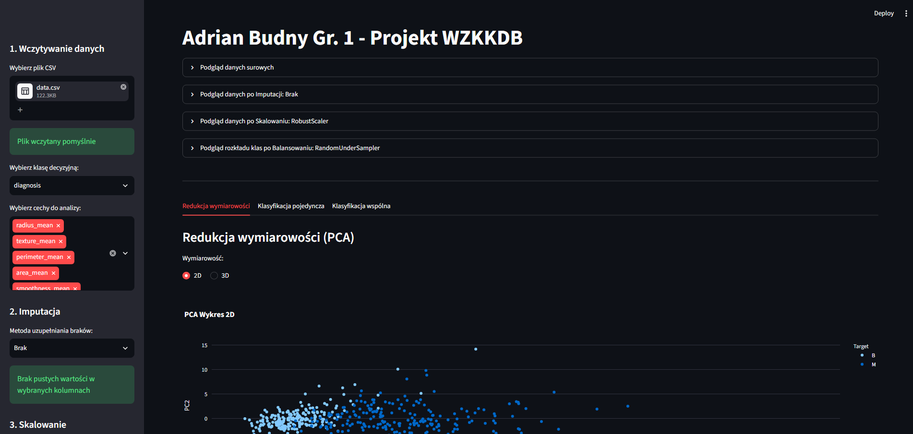
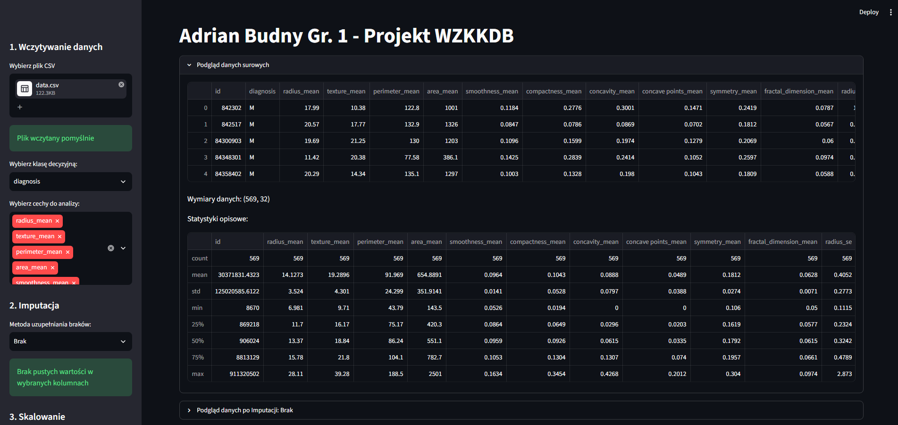
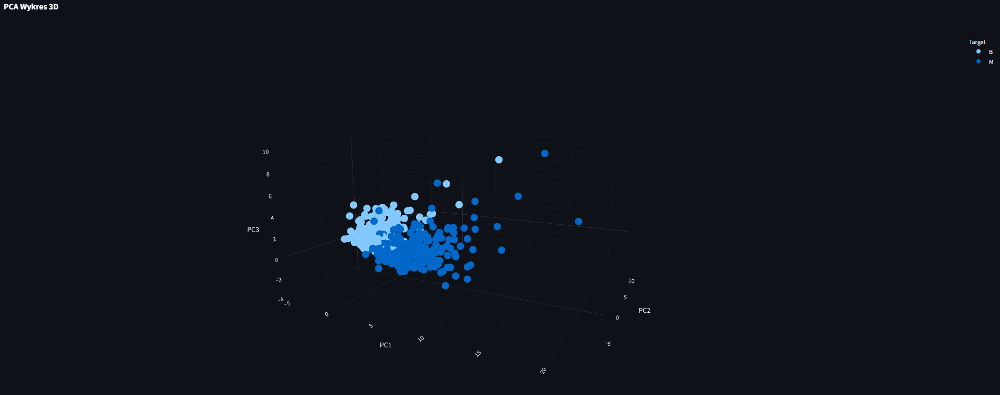
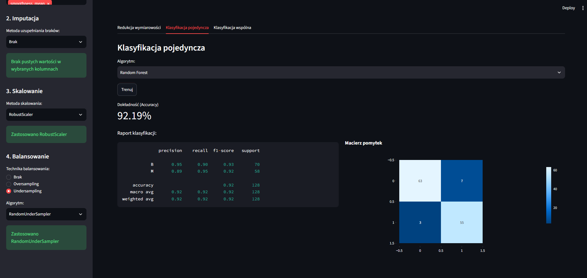
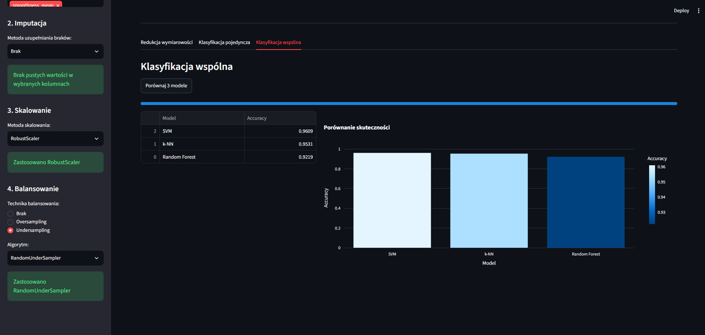

# Narzędzie do analizy i klasyfikacji danych biometrycznych

Interaktywna aplikacja webowa wspierająca proces przygotowania, transformacji, redukcji wymiarowości oraz uczenia maszynowego na danych tabelarycznych i biometrycznych.

---

## O projekcie
Projekt został wykonany w ramach zajęć „Wprowadzenie do zagadnień klasyfikacji i klasteryzacji danych biometrycznych” na semestrze zimowym 2025/2026, studiów drugiego stopnia.

Aplikacja powstała jako wszechstronne narzędzie analityczne ułatwiające badaczom i studentom przejście przez kompletny cykl uczenia maszynowego (ML pipeline) bez konieczności pisania kodu. Aplikacja dedykowana jest w szczególności danym biometrycznym i medycznym (np. cechom jądra komórkowego przy diagnostyce nowotworów), gdzie kluczową rolę odgrywa poprawna imputacja braków, skalowanie wartości numerycznych oraz balansowanie klas decyzyjnych.

Dzięki integracji bibliotek Streamlit, Scikit-learn, Imbalanced-learn oraz Plotly, użytkownik ma natychmiastowy, wizualny wgląd w to, jak każdy kolejny krok preprocessingu modyfikuje strukturę zbioru danych przed podaniem go do modeli klasyfikacyjnych.

---

## Kluczowe funkcjonalności

1. **Wczytywanie i eksploracja zbioru:**
   * Obsługa plików w formacie `.csv`.
   * Automatyczna eliminacja pustych kolumn.
   * Dynamiczny wybór zmiennej decyzyjnej (`target`) oraz podzbioru atrybutów do analizy.
   * Interaktywny podgląd próbek danych i statystyk opisowych (`df.describe()`).

2. **Zaawansowany preprocessing:**
   * **Imputacja braków danych:** usunięcie wierszy zawierających `NaN` lub uzupełnienie statystyczne (*średnia*, *mediana*, *wartość najczęstsza*).
   * **Skalowanie i normalizacja:** standaryzacja `StandardScaler` _(Z-score)_, normalizacja `MinMaxScaler` do zakresu $[0, 1]$ oraz `RobustScaler` (odporny na wartości odstające).
   * **Balansowanie klas:**
     * Nadpróbkowanie (_ang._ Oversampling) algorytmy `SMOTE` oraz `ADASYN`.
     * Podpróbkowanie (_ang._ Undersampling): `RandomUnderSampler` oraz `TomekLinks`.
     * Porównawczy wykres słupkowy liczności klas przed i po wykonaniu resamplingu.

3. **Redukcja wymiarowości (PCA):**
   * Rzutowanie przestrzeni cech numerycznych metodą `Principal Component Analysis (PCA)` na płaszczyznę 2D lub przestrzeń 3D.
   * Interaktywna wizualizacja rozrzutu danych za pomocą biblioteki `Plotly Express` z kolorystycznym wyróżnieniem etykiet klas.

4. **Uczenie maszynowe i ewaluacja:**
   * **Klasyfikacja pojedyncza:** trenowanie i analiza wybranego modelu (`Random Forest`, `k-NN`, `SVM`). Wyświetlanie metryki dokładności (_Accuracy_), szczegółowego raportu (_Precision_, _Recall_, _F1-score_, _Support_) oraz interaktywnej macierzy pomyłek (_ang._ Confusion Matrix).
   * **Klasyfikacja wspólna (Benchmark):** jednoczesne trenowanie wszystkich 3 algorytmów na tym samym podziale testowym (70% train / 30% test), zestawienie tabelaryczne oraz porównawczy wykres słupkowy.

---

<p align="center">
  
  <br>
  <em>Rysunek 1: Widok ogólny interfejsu aplikacji po wczytaniu danych i skonfigurowaniu parametrów w panelu bocznym.</em>
</p>

<br>

<p align="center">
  
  <br>
  <em>Rysunek 2: Rozwinięta sekcja „Podgląd danych surowych” prezentująca próbkę rekordów, wymiary oraz statystyki opisowe zbioru.</em>
</p>

<br>

<p align="center">
  
  <br>
  <em>Rysunek 3: Trójwymiarowa wizualizacja rzutowania cech po redukcji wymiarowości metodą PCA z podziałem na klasy decyzyjne.</em>
</p>

<br>

<p align="center">
  
  <br>
  <em>Rysunek 4: Wyniki trenowania i ewaluacji pojedynczego modelu (Random Forest) z metryką dokładności, raportem klasyfikacji oraz macierzą pomyłek.</em>
</p>

<br>

<p align="center">
  
  <br>
  <em>Rysunek 5: Porównanie skuteczności trzech klasyfikatorów (Random Forest, k-NN, SVM) w ujęciu tabelarycznym i na wykresie słupkowym.</em>
</p>

---

## Technologie i narzędzia

* **Język programowania:** [Python 3.13.5](https://www.python.org/)
* **Interfejs webowy:** [Streamlit](https://streamlit.io/)
* **Manipulacja i analiza danych:** [Pandas](https://pandas.pydata.org/), [NumPy](https://numpy.org/)
* **Uczenie maszynowe i preprocessing:** [scikit-learn](https://scikit-learn.org/)
* **Równoważenie klas:** [imbalanced-learn](https://imbalanced-learn.org/)
* **Wizualizacje interaktywne:** [Plotly Express](https://plotly.com/python/)

---

## Instrukcja instalacji i uruchomienia

### Wymagania

* Zainstalowany interpreter **Python w wersji 3.10 lub nowszej** (aplikacja w pełni przetestowana na wersji **3.13.5**).
* Narzędzie do zarządzania pakietami `pip`.

### Instrukcja instalacji i uruchomienia

1. **Sklonuj repozytorium na dysk lokalny:**
   ```bash
   git clone https://github.com/AdiKungen/Projekt_WZKKDB_Budny_Adrian_MUI1.git
   cd Projekt_WZKKDB_Budny_Adrian_MUI1
   ```

2. **Utwórz i aktywuj środowisko wirtualne:**
   * Na systemie Windows (PowerShell):
     ```powershell
     python -m venv .venv
     .\.venv\Scripts\Activate.ps1
     ```
     *(W systemie Windows w przypadku problemu z aliasem `python` możesz użyć polecenia: `py -m venv .venv`)*
     
   * Na systemie Linux / macOS:
     ```bash
     python3 -m venv .venv
     source .venv/bin/activate
     ```

3. **Zainstaluj wymagane pakiety:**
   ```bash
   pip install --upgrade pip
   pip install -r requirements.txt
   ```

4. **Uruchom aplikację Streamlit:**
   ```bash
   streamlit run app.py
   ```
   Aplikacja otworzy się automatycznie w Twojej domyślnej przeglądarce pod adresem: `http://localhost:8501` *(w przypadku zajętego portu zostanie przydzielony kolejny wolny port, np. 8502)*.

### Przykładowy zbiór danych do testów

W repozytorium przygotowano gotowy plik z danymi do przetestowania wszystkich funkcjonalności aplikacji:
* **Lokalizacja:** [`demo-data/data.csv`](demo-data/data.csv)
* **Charakterystyka:** Zbiór zawiera **569 rekordów** oraz **30 numerycznych cech** opisujących właściwości jądra komórkowego (m.in. promień, teksturę, obwód, pole powierzchni, symetrię).
* **Zmienna decyzyjna (Target):** Kolumna `diagnosis` określająca typ zmiany nowotworowej: złośliwa (**M** - _Malignant_, 212 próbek) lub łagodna (**B** - _Benign_, 357 próbek).

---

## Podziękowania / Credits

* **Zbiór danych:** [Breast Cancer Wisconsin (Diagnostic)](https://archive.ics.uci.edu/dataset/17/breast+cancer+wisconsin+diagnostic) udostępniony pierwotnie przez [UCI Machine Learning Repository](https://archive.ics.uci.edu/) na licencji [Creative Commons Attribution 4.0 International (CC BY 4.0)](https://creativecommons.org/licenses/by/4.0/) (dostępny również jako mirror w serwisie [Kaggle](https://www.kaggle.com/datasets/uciml/breast-cancer-wisconsin-data)).
  * *Twórcy:* W. Nick Street, W. H. Wolberg, O. L. Mangasarian

---

## Licencja / License

**PL:**  
Copyright (c) 2026 Adrian Budny. Wszelkie prawa zastrzeżone.  
Kod źródłowy tego projektu udostępniony jest wyłącznie do wglądu w celach demonstracji portfolio i weryfikacji umiejętności. Kopiowanie, modyfikowanie, rozpowszechnianie lub wykorzystywanie tego kodu w celach komercyjnych lub prywatnych bez pisemnej zgody autora jest zabronione.

**EN:**  
Copyright (c) 2026 Adrian Budny. All rights reserved.  
This source code is made publicly available solely for portfolio demonstration and technical evaluation. No permission is granted to copy, modify, distribute, or use this code for any commercial or non-commercial purpose without prior written consent from the author.
